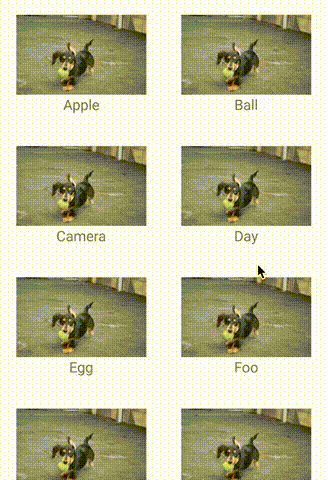

RecyclerView Animators
======================
<p align="center">
  
</p>

[](https://gitter.im/wasabeef/recyclerview-animators?utm_source=badge&utm_medium=badge&utm_campaign=pr-badge&utm_content=badge)  

[](https://android-arsenal.com/details/1/1327)
[](https://www.apache.org/licenses/LICENSE-2.0)
[](https://bintray.com/wasabeef/maven/recyclerview-animators/_latestVersion)

RecyclerView Animators is an Android library that allows developers to easily create RecyclerView with animations.

Please feel free to use this.

# Features

* Animate addition and removal of `ItemAnimator`
* Appearance animations for items in `RecyclerView.Adapter`

# Demo

### ItemAnimator
  

### Adapters
 

# Samples

<a href="https://play.google.com/store/apps/details?id=jp.wasabeef.example.recyclerview"></a>

# How do I use it?

## Setup

#### Gradle

**If you are using a RecyclerView 23.1.0 (released Oct 2015) or higher.**
```groovy
dependencies {
  // jCenter
  compile 'jp.wasabeef:recyclerview-animators:2.2.0'
}
```

**If you are using a RecyclerView 23.0.1 or below.**
```groovy
dependencies {
  // jCenter
  compile 'jp.wasabeef:recyclerview-animators:1.3.0'
}
```

## ItemAnimator
### Step 1

Set RecyclerView ItemAnimator.

```java
RecyclerView recyclerView = (RecyclerView) findViewById(R.id.list);
recyclerView.setItemAnimator(new SlideInLeftAnimator());
```

```java
RecyclerView recyclerView = (RecyclerView) findViewById(R.id.list);
recyclerView.setItemAnimator(new SlideInUpAnimator(new OvershootInterpolator(1f)));
```

## Step 2
Please use the following  
`notifyItemChanged(int)`  
`notifyItemInserted(int)`  
`notifyItemRemoved(int)`  
`notifyItemRangeChanged(int, int)`  
`notifyItemRangeInserted(int, int)`  
`notifyItemRangeRemoved(int, int)`  

> If you want your animations to work, do not rely on calling `notifyDataSetChanged()`; 
> as it is the RecyclerView's default behavior, animations are not triggered to start inside this method.

```java
public void remove(int position) {
  mDataSet.remove(position);
  notifyItemRemoved(position);
}

public void add(String text, int position) {
  mDataSet.add(position, text);
  notifyItemInserted(position);
}
```

### Advanced Step 3

You can change the durations.

```java
recyclerView.getItemAnimator().setAddDuration(1000);
recyclerView.getItemAnimator().setRemoveDuration(1000);
recyclerView.getItemAnimator().setMoveDuration(1000);
recyclerView.getItemAnimator().setChangeDuration(1000);
```

### Advanced Step 4

Change the interpolator.

```java
SlideInLeftAnimator animator = new SlideInLeftAnimator();
animator.setInterpolator(new OvershootInterpolator());
// or recyclerView.setItemAnimator(new SlideInUpAnimator(new OvershootInterpolator(1f));
recyclerView.setItemAnimator(animator);
```

### Advanced Step 5

By extending AnimateViewHolder, you can override preset animation.  
So, custom animation can be set depending on view holder.

```java
static class MyViewHolder extends AnimateViewHolder {

  public MyViewHolder(View itemView) {
    super(itemView);
  }

  @Override
  public void animateRemoveImpl(ViewPropertyAnimatorListener listener) {
    ViewCompat.animate(itemView)
          .translationY(-itemView.getHeight() * 0.3f)
          .alpha(0)
          .setDuration(300)
          .setListener(listener)
          .start();
  }

  @Override
  public void preAnimateAddImpl() {
    ViewCompat.setTranslationY(itemView, -itemView.getHeight() * 0.3f);
    ViewCompat.setAlpha(itemView, 0);
  }

  @Override
  public void animateAddImpl(ViewPropertyAnimatorListener listener) {
    ViewCompat.animate(itemView)
          .translationY(0)
          .alpha(1)
          .setDuration(300)
          .setListener(listener)
          .start();
  }
}
```

### Animators

#### Cool
`LandingAnimator`

##### Scale
`ScaleInAnimator`, `ScaleInTopAnimator`, `ScaleInBottomAnimator`  
`ScaleInLeftAnimator`, `ScaleInRightAnimator`


##### Fade
`FadeInAnimator`, `FadeInDownAnimator`, `FadeInUpAnimator`  
`FadeInLeftAnimator`, `FadeInRightAnimator`

##### Flip
`FlipInTopXAnimator`, `FlipInBottomXAnimator`  
`FlipInLeftYAnimator`, `FlipInRightYAnimator`

##### Slide
`SlideInLeftAnimator`, `SlideInRightAnimator`, `OvershootInLeftAnimator`, `OvershootInRightAnimator`  
`SlideInUpAnimator`, `SlideInDownAnimator`

## RecyclerView.Adapter
### Step 1

Set RecyclerView ItemAnimator.

```java
RecyclerView recyclerView = (RecyclerView) findViewById(R.id.list);
MyAdapter adapter = new MyAdapter();
recyclerView.setAdapter(new AlphaInAnimationAdapter(adapter));
```

### Advanced Step 2

Change the durations.

```java
MyAdapter adapter = new MyAdapter();
AlphaInAnimationAdapter alphaAdapter = new AlphaInAnimationAdapter(adapter);
alphaAdapter.setDuration(1000);
recyclerView.setAdapter(alphaAdapter);
```

### Advanced Step 3

Change the interpolator.

```java
MyAdapter adapter = new MyAdapter();
AlphaInAnimationAdapter alphaAdapter = new AlphaInAnimationAdapter(adapter);
alphaAdapter.setInterpolator(new OvershootInterpolator());
recyclerView.setAdapter(alphaAdapter);
```

### Advanced Step 4

Disable the first scroll mode.

```java
MyAdapter adapter = new MyAdapter();
AlphaInAnimationAdapter alphaAdapter = new AlphaInAnimationAdapter(adapter);
scaleAdapter.setFirstOnly(false);
recyclerView.setAdapter(alphaAdapter);
```

### Advanced Step 5

Multiple Animations

```java
MyAdapter adapter = new MyAdapter();
AlphaInAnimationAdapter alphaAdapter = new AlphaInAnimationAdapter(adapter);
recyclerView.setAdapter(new ScaleInAnimationAdapter(alphaAdapter));
```

### Adapters

#### Alpha
`AlphaInAnimationAdapter`

#### Scale
`ScaleInAnimationAdapter`

#### Slide
`SlideInBottomAnimationAdapter`  
`SlideInRightAnimationAdapter`, `SlideInLeftAnimationAdapter`

Applications using RecyclerView Animators
---

Please [ping](mailto:dadadada.chop@gmail.com) me or send a pull request if you would like to be added here.

Icon | Application
------------ | -------------
 | [Ameba Ownd](https://play.google.com/store/apps/details?id=jp.co.cyberagent.madrid)
 | [QuitNow!](https://play.google.com/store/apps/details?id=com.EAGINsoftware.dejaloYa)

Developed By
-------
Daichi Furiya (Wasabeef) - <dadadada.chop@gmail.com>

<a href="https://twitter.com/wasabeef_jp">

</a>

Contributions
-------

Any contributions are welcome!

Contributers
-------

* [craya1982](https://github.com/craya1982)

Thanks
-------

* Inspired by `AndroidViewAnimations` in [daimajia](https://github.com/daimajia).

License
-------

    Copyright 2015 Wasabeef

    Licensed under the Apache License, Version 2.0 (the "License");
    you may not use this file except in compliance with the License.
    You may obtain a copy of the License at

       http://www.apache.org/licenses/LICENSE-2.0

    Unless required by applicable law or agreed to in writing, software
    distributed under the License is distributed on an "AS IS" BASIS,
    WITHOUT WARRANTIES OR CONDITIONS OF ANY KIND, either express or implied.
    See the License for the specific language governing permissions and
    limitations under the License.
